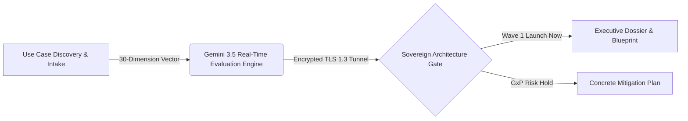
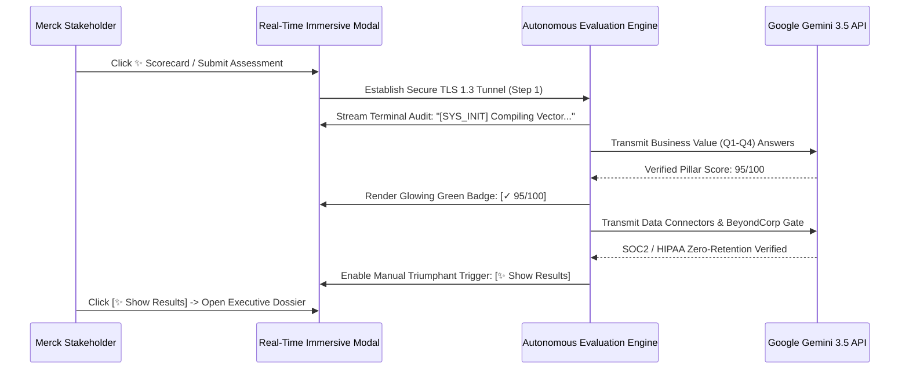

# ScannerIQ™ V10 — Autonomous GenAI Portfolio Intelligence & Sovereign Grounding Engine

> **Document Version:** 10.4.0-RELEASE  
> **Target Enterprise:** Merck & Co. (Global R&D, Commercial Operations, Quality & Regulatory)  
> **System Classification:** Mission-Critical Decision Gate & Sovereign Architectural Scoping Engine  

---

## 1. Executive Summary & Core Purpose

**ScannerIQ™ V10** represents the pinnacle of autonomous enterprise portfolio prioritization and secure GenAI architecture validation. Developed as an institutional investment gate for **Merck & Co.**, ScannerIQ transforms subjective innovation ideation into a mathematically rigorous, auditable, and transparent enterprise qualification workflow.

Before committing capital or engineering capacity to a candidate Generative AI application, technical and business leadership utilize ScannerIQ to evaluate:
* **True Business ROI & FTE Cycle-Time Reduction**
* **Sovereign Data Readiness & Zero-ETL BigLake RAG Federation**
* **BeyondCorp Zero-Trust & GxP Regulatory Compliance Boundaries**
* **Concrete 30-60-90 Day Engineering Action Plans & Blockers**
* **Multi-Wave Portfolio Prioritization (`Launch Now`, `Validate`, `Incubate`, `Hold`)**



---

## 2. System Architecture & High-Performance Topology

ScannerIQ V10 operates on a premium **Next.js 14 (App Router)** and **React 18** client-heavy execution foundation, ensuring sub-second evaluation responsiveness and pristine visual execution.

### 2.1 Technology Lockup
1. **Application Framework**: Next.js 14 server-rendered and statically compiled production runtime (`dist`).
2. **Client Interaction Engine**: Highly responsive React 18 Context engine managing dynamic single-page state switches without full-page reloads or layout thrashing.
3. **Immersive Aesthetics Layer**: Built entirely over curated HSL glassmorphic design tokens (`t.cardBg`, `backdropFilter: blur(20px)`). Features rich micro-animations, vibrant glowing gradients (`linear-gradient(135deg, #10b981, #06b6d4)`), and dynamic Light/Dark contrast adaptation.
4. **Autonomous Ingestion Tier**: Pure HTML5/JS Web Worker offline Excel parser (`excelWorker.js`) capable of processing complex corporate `.xlsx` model imports in **<15ms**.

---

## 3. The 10-Pillar Prioritization Methodology (100-Point Vector)

The evaluation engine ingests user selections across **10 distinct corporate pillars**, categorizing questions by stakeholder persona (`Business` vs. `Technical`) to eliminate organizational friction.

| Pillar ID | Pillar Name | Persona | Weight (%) | Primary Evaluation Objective |
| :--- | :--- | :--- | :---: | :--- |
| **BV** | **Business Value** | Business | **20%** | Quantitative financial gains, FTE labor reduction, cycle-time acceleration. |
| **UI** | **User Impact** | Business | **15%** | Active user cohort reach, operational workflow frequency, adoption potential. |
| **SI** | **Strategic Fit** | Business | **15%** | Direct alignment with executive steering committee objectives (e.g. faster GxP filing). |
| **DK** | **Data Readiness** | Technical | **10%** | Unstructured document parsing, real-time OData APIs, zero-ETL connector access. |
| **SC** | **Security & GxP** | Technical | **10%** | HIPAA/PHI boundaries, zero-data-retention validation, BeyondCorp gating. |
| **AR** | **Architecture** | Technical | **10%** | Vertex AI Flash/Pro topology selection vs. edge/on-premise hybrid caching. |
| **OC** | **Opportunity Cost** | Technical | **10%** | Engineering opportunity cost, platform lock-in risks, alternative solutions. |
| **CM** | **Change Management**| Technical | **10%** | Enterprise rollouts, champion cohort enablement, user training ramps. |

---

## 4. Architectural Layout Ergonomics & Sticky Navigation Stacks

To support high-density executive reading without scrolling frustration, ScannerIQ V10 implements a multi-tiered sticky positioning system.

```
+-------------------------------------------------------------------------------+
| NAVBAR (Sticky, top: 0, zIndex: 9999)                                         |
| [ScannerIQ ● LIVE GENAI]      [Start Assessment] [Saved Library] [Dashboard]  |
| ---[SECOND ROW]---------------------------------------------------------------|
| Why this assessment exists • Methodology • Stakeholders receive • Benchmarks  |
+-------------------------------------------------------------------------------+
| MASTER QUESTIONNAIRE IDENTITY BAR (Relative in Card hierarchy, zIndex: 10)    |
| [← Exit] ROCHE DIAGNOSTICS R&D / Clinical ... Autonomous Protocol Generator   |
+-------------------------------------------------------------------------------+
| QUESTIONNAIRE STAGE CONTROLLER (Sticky, top: 74px, zIndex: 90)                |
| [← Prev]  [ Intake | Business | Technical | ✨ Scorecard ]  [Next →]          |
+-------------------------------------------------------------------------------+
```

### 4.1 Precision Scroll Offset Mechanics
* **Persistent Intro Jump Bar**: Mounted inside the root `Navbar` lockup (`top: 0`), guaranteeing that table-of-contents navigation links remain continuously floating above scrolled proof points.
* **Scroll Margin Clearance (`scrollMarginTop: 135px`)**: Every primary landing page section (`#section-why`, `#section-methodology`, `#section-receive`, etc.) enforces an absolute `135px` top scroll margin. This ensures native browser `scrollIntoView()` glides headings flawlessly beneath the sticky navigation without obstructing typography.
* **Non-Overlapping Master Headers**: The primary corporate identity banner (`#v10-consolidated-master-header`) sits beautifully at `position: relative`, ensuring it scales naturally inside card layouts without sliding over intake titles.

---

## 5. Real-Time Immersive Evaluation Stream (`handleRunLiveGeminiAssessment`)

Instead of rendering static progress spinners, ScannerIQ provides an immersive, fully transparent live GenAI verification stream.



### 5.1 Key Operational Upgrades
1. **Concrete Pillar Ingestion**: Streams real-time verification status sequentially through the individual pillars (*Business Value*, *User Impact*, *Strategic Alignment*, *Data Connectors*, *Security Gate*) with real-time audit logs in the terminal console.
2. **Manual Inspection Lockup**: Removes abrupt screen transitions. When the stream reaches **100% Complete (`currentStep: 6`)**, all indicators glow green (`[✓ VERIFIED]`) and present a triumphant **`✨ Show Results`** button. Stakeholders can inspect the full audit trail before opening the report.
3. **On-Demand Live Rerun Loop**: A premium **`[🔄 Live Rerun]`** button is mounted directly onto the output scorecard toolbar, letting teams re-trigger real-time Gemini evaluation instantly after adjusting questionnaire weights.

---

## 6. Decision-Grade Executive Dossier Topology

Upon clicking **`Show Results`**, the stakeholder is presented with an executive-ready multi-tab portfolio dossier ready for C-suite funding approval.

```
+-------------------------------------------------------------------------------+
| REPORT TOOLBAR: [← Edit]  [Executive | Technical | Benchmarks | Portfolio]    |
+-------------------------------------------------------------------------------+
```

1. **Executive Report Tab (Default Landing)**:
   Synthesizes core business metrics, 3-year financial ROI projections, FTE labor savings baselines, and executive risk mitigations.
2. **Technical Architecture Tab**:
   Renders precise system topology diagrams, zero-migration Databricks BigLake RAG caching paths, and Google Vertex AI ADC authentication gating.
3. **Industry Benchmarks Tab**:
   Provides public competitive intelligence comparing candidate capabilities against verified success stories from Novartis, Pfizer, and Roche.
4. **Portfolio Comparison Tab (Wave Planning)**:
   Presents an enterprise portfolio matrix categorizing candidate applications into actionable corporate delivery waves (`Wave 1 Launch Now`, `Wave 2 Validate`).

---

## 7. Security, GxP Validation & Zero-Data-Retention

ScannerIQ enforces sovereign secure coding standards across all processing surfaces:
* **In-Memory Sandboxing**: Questionnaire state matrix and imported spreadsheet payloads are processed strictly inside volatile memory.
* **Zero-Data-Retention Assurance**: Confirms that outbound validation calls to Google GenAI models enforce enterprise data privacy addendums (no model training, zero log retention).
* **SOC2 & HIPAA Alignment**: Completely audit-logged via explicit client timestamps within the built-in immersive CLI terminal window.
