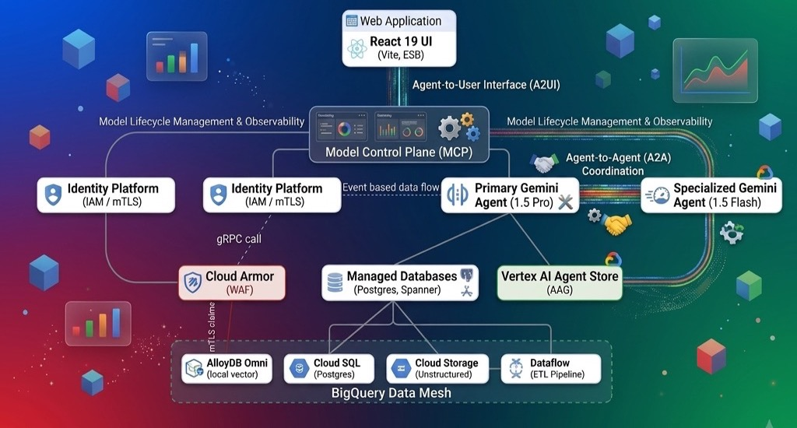
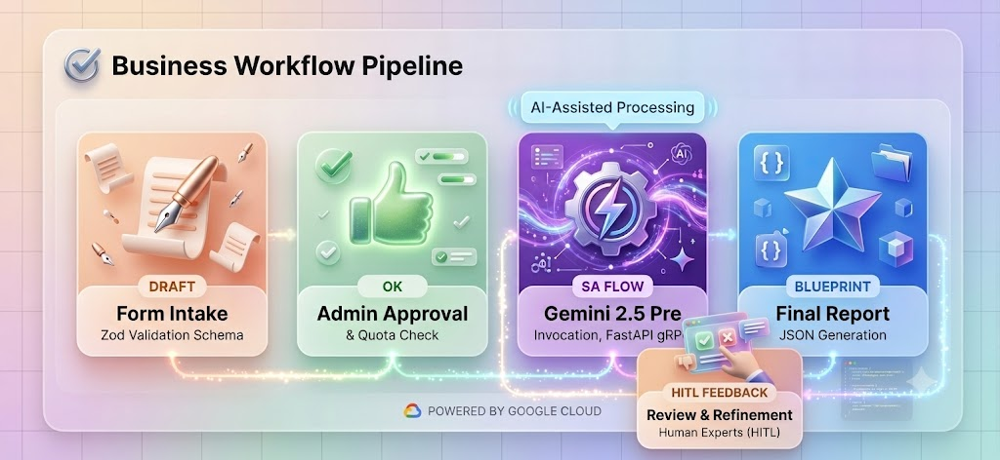
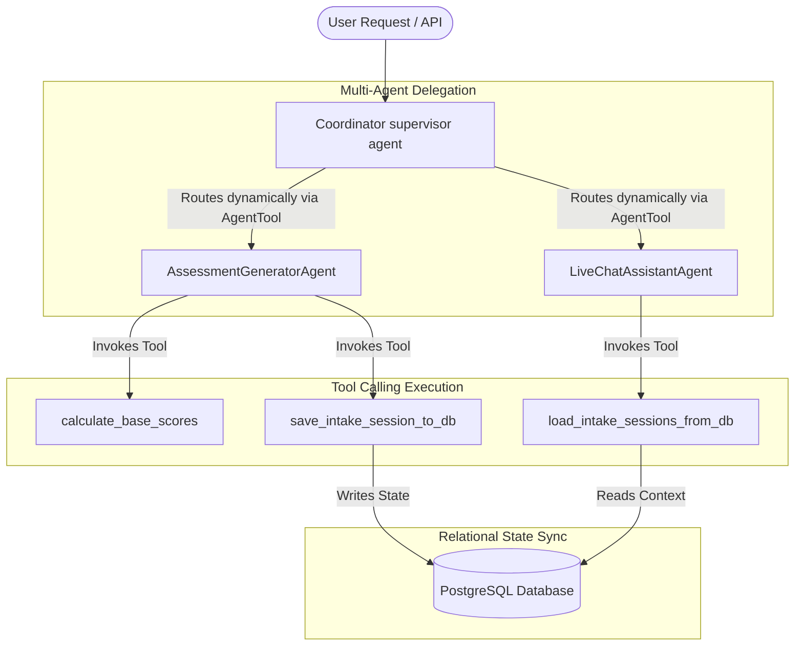

# 🧬 Gemini Enterprise Use Case Suite & Scoping Advisor

> **Accelerating AI Scoping, Architecture Validation, and TCO Payback Estimation for Regulated Industries.**

[](https://nitinagga.c.googlers.com)
[](https://www.postgresql.org/)
[](https://deepmind.google/technologies/gemini/)

The **Gemini Enterprise Use Case Suite** is an elite consultative scoping application designed for Customer Engineers (CEs), Solution Architects (SAs), and Google FDEs to accelerate enterprise Generative AI discovery and architectural validation. Tailored specifically for HCLS, biopharma, and other highly regulated industries, it streamlines compliance due diligence, computes multi-dimensional readiness scores, generates joint technical roadmaps, and estimates TCO economics.

---

## 📸 Architectural Blueprint & Workflows

### 1. System Topology Architecture
The tool maps legacy source databases (like Veeva Vault, Snowflake, and LIMS SQL Servers) through secure cross-cloud VPC perimeters into GCP-native topologies:


### 2. Multi-Agent Reasoning Pipeline
Dynamic Objections mapping and 4-week joint technical roadmap generation are driven by a stateful multi-agent system orchestrating Vertex AI and local diagnostics:


---

## 🤖 Agentic AI Architecture (Supervisor-Worker Pattern)

The application backend uses a stateful, multi-agent coordination pattern built on top of the **Google Application Development Kit (ADK)** and **Vertex AI Agent Engines**:



*   **Coordinator (Supervisor)**: Evaluates user intent (intake data vs questions/objections) and dynamically delegates execution paths using the `AgentTool` abstraction.
*   **AssessmentGeneratorAgent**: Worker agent focused strictly on technical risk audits and base score calculations. Returns structured data matching the `AssessmentReport` JSON schema.
*   **LiveChatAssistantAgent**: Worker agent focused on real-time conversational assistance, objection handling, and joint roadmap creation.
*   **Environment Integrations (Tools)**: Specialized Python functions (`calculate_base_scores`, `save_intake_session_to_db`, `load_intake_sessions_from_db`) bound to the agents to synchronize state directly with the local PostgreSQL database.

---

## 💎 Customer Value Proposition

Regulated enterprises (e.g. Merck, Pfizer, and global biopharma) face unique hurdles when moving from LLM sandboxes to production. The Use Case Suite addresses the three core friction points in every discovery meeting:

*   **🔒 Security & Geofencing Isolation**: Automatically audits network egress routing, whitelisting, and VPC-SC perimeter boundaries. Ensures compliance with European data sovereignty (e.g. geofencing in `europe-west9`) and HIPAA perimeters.
*   **📋 GxP Validation Readiness**: Identifies early whether the workload requires **21 CFR Part 11 validation**, authorizing QA change control templates and scheduling GxP validation engineering hours early.
*   **📊 Hard Unit Economics**: Calculates realistic FTE hours saved, process automation rates, API compute fees, and charts the **TCO Payback Period** to present a concrete business case to the CFO.

---

## 🛠️ Key Product Capabilities

### 1. Greenfield & Migration Scoping Pathways
*   **Build fresh (Greenfield)**: Direct assessment of Vertex AI Agent Builder, prompt caching, and grounding vector indexes.
*   **Recreate/Migrate (Legacy)**: Compiles prompt portability, vector database conversions, and rollback strategies when transitioning workloads off Azure OpenAI or AWS Bedrock.

### 2. Symmetrical 67-Question Discovery Audit
Exhaustive, state-reactive matrix covering 11 critical pillars:
*   Use Case Context & Domain
*   Business Pain & Downstream Urgency
*   Strategic Value & Commercial Commits
*   Interaction Patterns & User Personas
*   Data Freshness & Schema Drift Management
*   Cross-Cloud Connectivity & Private Service Connect (PSC)
*   Identity Management (IAM & delegated OAuth)
*   FDA GxP & CMEK Encryption Controls
*   Lifecycle Maintenance & Model Pinning

### 3. Interactive Topology Workbench
Includes embedded, bi-directional **Diagrams.net (Draw.io)** canvas support allowing Customer Engineers to interactively modify, save, and export current-state and target-state system topology blueprints.

---

## 🚀 Getting Started (Cloudtop Deployment)

The application runs as a self-contained environment on your Cloudtop, backed by a local **PostgreSQL** database instance.

### Prerequisites
*   Node.js (v18+) via NVM
*   Python 3.10+ (pip)
*   PostgreSQL running on standard port `5432`

### Run Backend API & Database Server
The FastAPI server manages sessions and runs queries using the Google ADK library.
```bash
# Navigate to the folder
cd ~/usecase_scoring

# Activate the virtual environment
source .venv/bin/activate

# Start the FastAPI backend
uvicorn scoring_agent.main:app --host 0.0.0.0 --port 8000
```

### Run Frontend Dev Server
The React application communicates with the backend via the Vite proxy configuration.
```bash
# Navigate to the folder
cd ~/usecase_scoring

# Load NVM and start Vite
. ~/.nvm/nvm.sh
npm run dev
```
Access the application locally or through your Web Workstation proxy at `http://localhost:5173`.

---

## 📂 Repository Structure

```
├── public/                  # Static assets and system architecture blueprints
├── scoring_agent/           # Backend API engine & ADK Python agents
│   ├── main.py              # FastAPI server (PostgreSQL database CRUD hooks)
│   ├── agent.py             # Vertex AI ADK Scoping agents
│   ├── tools.py             # Calculated scoring and DB connector scripts
│   └── requirements.txt     # Python dependencies
├── src/                     # React Frontend
│   ├── App.jsx              # Main view modes, navigation, and router
│   ├── components/          # Portal components (V7 Discovery, Maturity, IAM)
│   └── services/            # API client and local simulation fallback engines
├── vite.config.js           # Server allowlists and backend /api proxy rules
└── deploy_to_cloudtop.sh    # Remote workstation build & deployment automation
```
